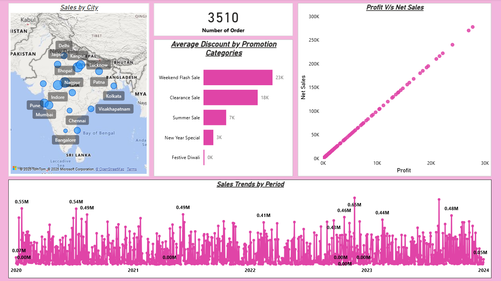

# 📊 Sales Data Analysis Dashboard

This dashboard was developed using Power BI to analyze product sales data from 2020 to 2024. Its main purpose is to provide comprehensive 
insights into sales trends, profit, promotions, and product performance, serving as a decision-support tool for business strategies.

---

## 🚀 Features & Requirements

1. Top/Bottom 5 Products
   - By Sales, Profit, and Quantity Sold.
   - Profit is assumed to be 10% of Net Sales.
2. Sales Trends Over Time
   - Analysis of sales patterns across daily, monthly, quarterly, and annual periods.
3. Sales vs Profit Relationship
   - Scatter plots to show how sales and profit correlate.
4. Period Comparison
   - Compare Sales / Profit / Quantity Sold between any two user-selected periods.
5. Average Discount Analysis
   - Shows average discount offered in each promotion/discount category.
6. Total Orders
   - Displays the number of orders placed in the dataset.
7. Order-Level Details with Filters
   - Sales, Profit, Discount, Net Sales, and other fields shown in a detailed table.
   - Can be filtered by Product, Date, Customer ID, or Promotion Categories.
8. Geographical Analysis
   - Sales breakdown by different cities (map visualization).

---

## 🛠️ Tech Stack
- **Power BI** → for data visualization  
- **Power Query** → for data transformation  
- **DAX** → for aggregate value & ratio calculations  

---

## 📈 Dashboard Preview & Explanation
### 1. Page 1 – Sales Overview
   
   This page provides a general overview of sales performance:
   - Sales by City → Interactive map showing sales distribution across major cities.
   - Number of Orders → Total orders recorded (3510).
   - Average Discount by Promotion Categories → Average discount applied across different promotion types (Weekend Flash Sale, Clearance Sale, Summer Sale, etc.).
   - Profit vs Net Sales → Scatter plot showing correlation between profit and net sales.
   - Sales Trends by Period → Sales performance trend from 2020 to 2024.
   
   👉 Insight: The Weekend Flash Sale promotion had the most significant impact on boosting sales.

### 2. Page 2 – Top & Bottom 5 Products
   
   This page highlights best and worst performing products:
   - Top 5 Products by Sales, Quantity, Profit → Highest performing products.
   - Bottom 5 Products by Sales, Quantity, Profit → Lowest performing products.
   
   👉 Insight:
   - Apple iPhone 14 dominates in sales, quantity, and profit.
   - Products like Tupperware Lunch Box and Nivea Body Lotion consistently appear among the bottom performers.

### 3. Page 3 & 4 – Comparison: Sales, Profit, Quantity
   This page provides a comparison of key sales metrics:
   - Date Filters → Two date slicers to compare performance across different time periods.
   - Total Sales, Total Profit, Total Quantity Sold → Compared using two methods:

     a. (DAX Query) → Calculated directly with DAX formulas.
        
     
     b. (Format Edit Interaction) → Generated through visual interaction with slicers.
        
   
   👉 Insight: Both approaches produce consistent results: Sales = 122M, Profit = 12.2M, and Quantity Sold = 7.1K.

### 4. Page 5 – Transaction Table
   
   This page displays detailed transaction-level data in an interactive table.
   
   #### a. Filters
     - Date → Filter transactions by time period.
     - Customer Name → View transactions by customer.
     - Product Name → Filter based on product type.
     - Promotion Name → Analyze transactions under specific promotions.

   #### b. Table Columns
     - CustomerID, Order ID, Product ID, Promotion ID
     - Date (dd/mm/yyyy)
     - Discount, Discount Percentage
     - Net Sales, Price Per Unit, Profit
     - Total Sales, Units Sold
   
   👉 This table allows granular analysis down to individual transactions.

---

## 🚀 Conclusion
The dashboard delivers a complete overview of:
- Sales distribution by city.
- Promotion effectiveness based on discount categories.
- Top & bottom products in terms of sales, quantity, and profit.
- Yearly sales trends for forecasting.
- Detailed transactional insights for deeper analysis.

With this dashboard, businesses can more easily identify top-performing products, evaluate promotional impact, and optimize future sales strategies.
